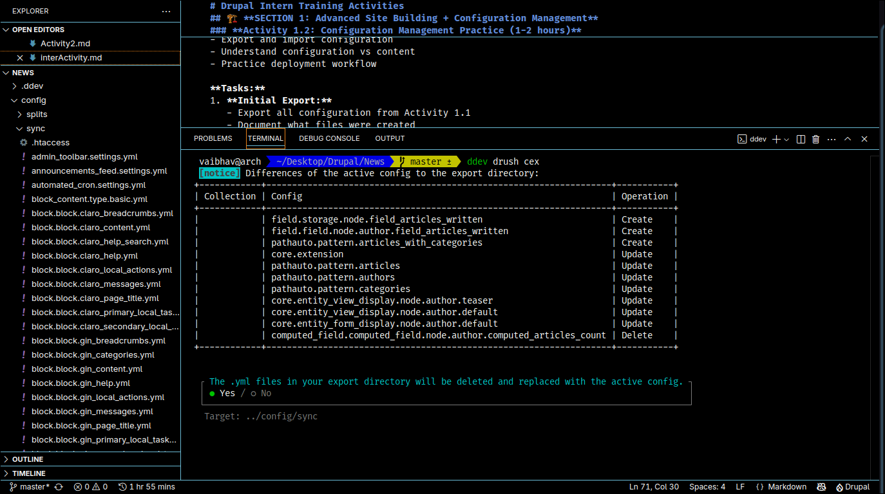
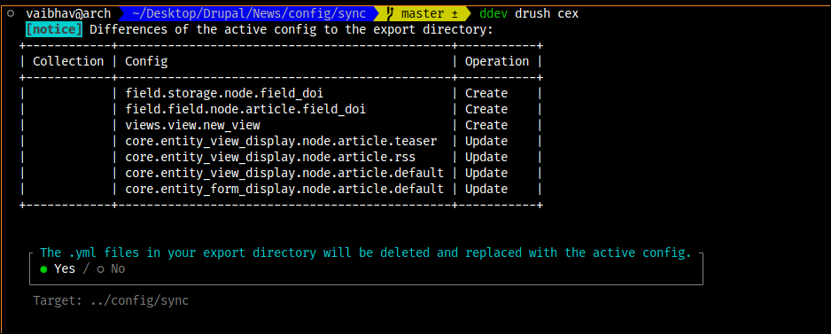
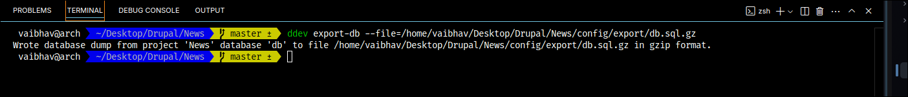

# Section 1
## Activity 1.2
### Configuration management

#### Task 1 : Initial export

1. I exported the configuration with the help of `ddev drush cex` command.
    which exports configuration to the path which is set inside settings.php file inside **/web/sites/default** folder

    - Exported the config at **../config/sync** folder
    - There are several yml files which follow `[config_type].[entity_type].[bundle].[field_name].yml` format.
      and a .htaccess file which is for security purpose.

2. 
    while updating the exported configuration after making some changes to the project.

3. Exported the split configuration for different development environments like development and production.

4. 
    After - Adding new field to the article content type
          - Creating a new view and
          - Modifying existing menu
    It added 3 new files and modifiles 4 existing files which are related to display the content which has been modified.

5. Exported the content using ddev export-db

