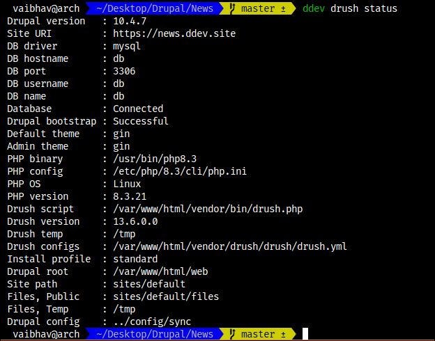
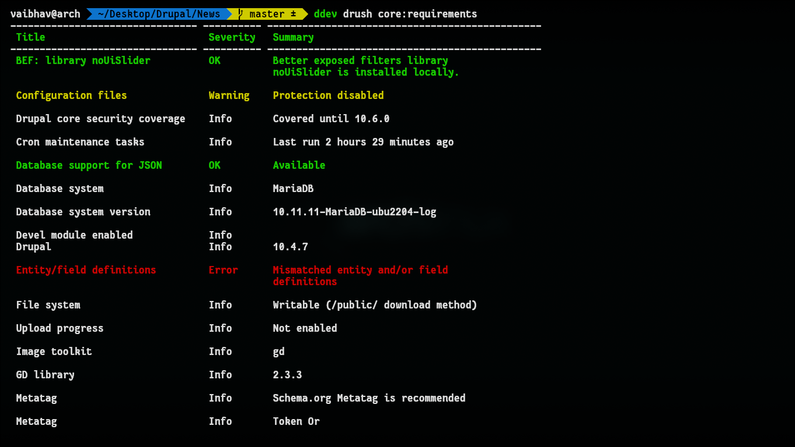
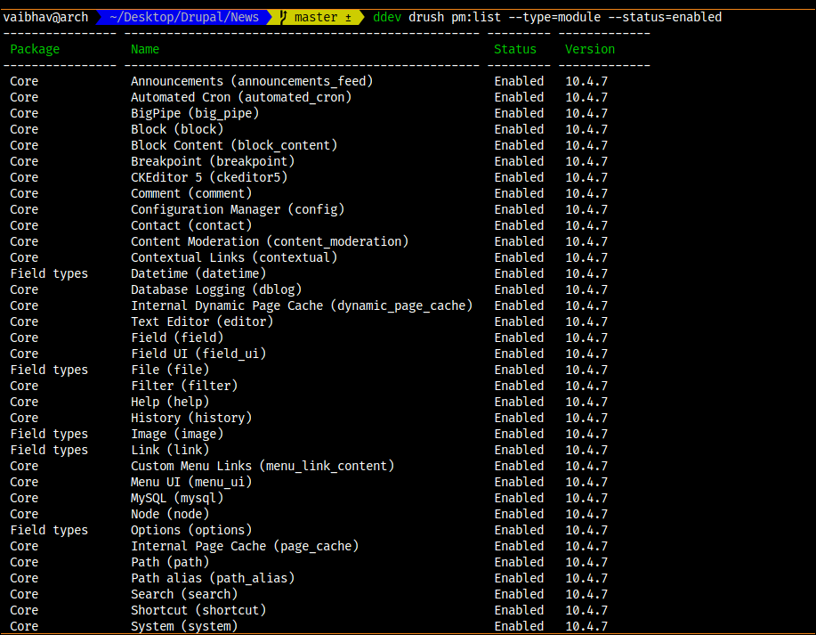
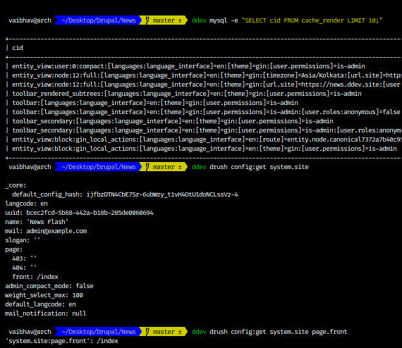
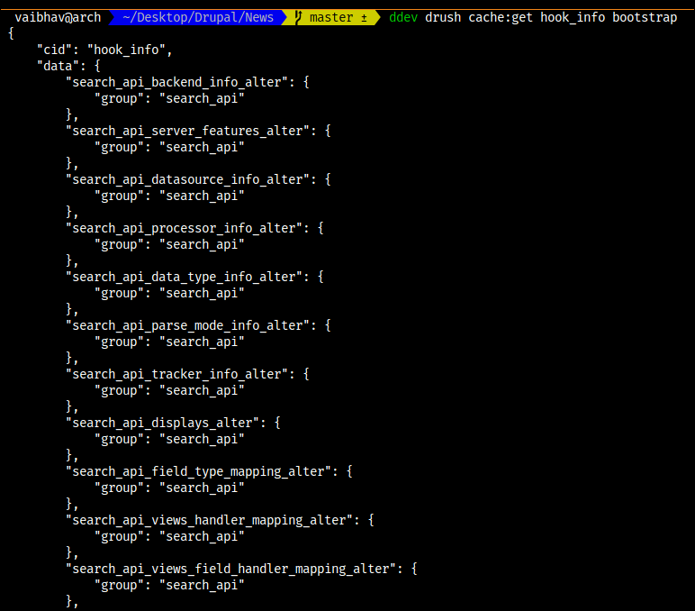
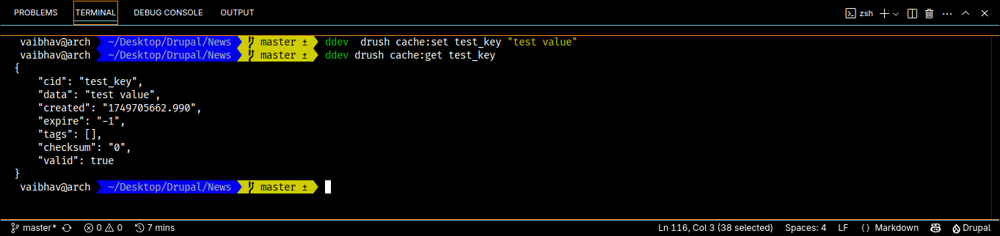
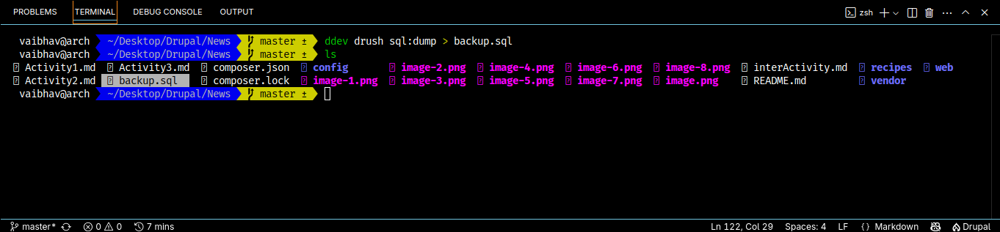
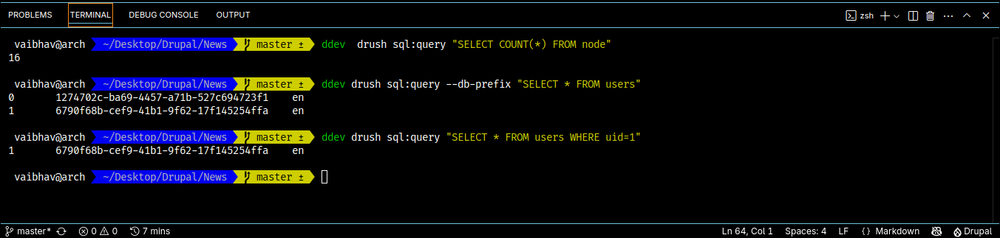
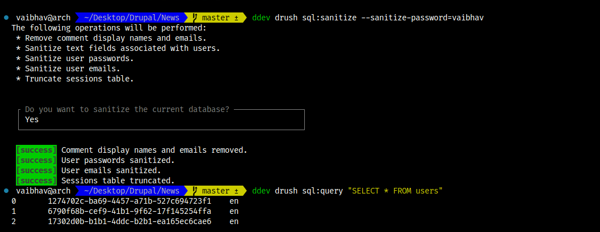

# Section 2
## Activity 2.1
### Essential Drush Commands

#### Site Information

1. `drush status`

    This command shows the important information about the current drupal site environment.
    like drupal version, sites url, database (hostname, port, username, etc), theme, php version and related info, etc.

2. `drush core:requirements` / `drush core:requirements`

    Status report which can be found at `/admin/reports/status`
    It includes the checks like
        PHP version
        MySQL/MariaDB version
        File permissions
        Trusted host settings
        Cron status
        Missing modules
        Security updates

    

3. `drush pm:list --type=module --status=enabled`

Displays all the modules which are enabled including core, contrib and custom.

    

4. `drush config:get [cid]`

    Display a config value, or a whole configuration object.

    

#### Cache management

1. `drush cache:rebuild` / `drush cr`
    Used to clear the cache often used when we change the twig files to reflect the latest changes to the site.

2. `drush cache:get / drush cg`
    Fetch a cached object and display it.

    

3. `drush cache:set / drush cs`
    Cache an object expressed in JSON or var_export() format.

    

#### Database operations

1. `drush sql:dump >backup.sql`
    The `drush sql:dump` command is used to export your Drupal site's database as an SQL file using `mysqldump` (or equivalent), allowing you to back up or migrate your site easily. You can customize the dump using options like `--result-file` to save the SQL file to a specific location, `--skip-tables-list` to exclude certain tables (e.g., cache), or `--extra-dump` to pass flags like `--no-data` to skip table contents. It supports compression via `--gzip`, filtering by tables or structure only, and can create dumps suited for syncing (`--create-db`). It's a versatile tool ideal for backups, migrations, and version-controlled environments.

    

2. `drush sql:query`
    The `drush sql:query` (alias `sqlq`) command allows you to run raw SQL queries directly against your Drupal site's database, making it a powerful tool for debugging, data inspection, or batch updates. You can pass SQL statements inline (`drush sql:query "SELECT * FROM users"`), from a file (`--file=example.sql`), or via a piped connection (`$(drush sql:connect) < file.sql`). If your site uses table prefixes, use `--db-prefix` to auto-replace `{}` tokens (e.g., `{users}` becomes `dr_users`). Additional flags allow exporting query results to a file (`--result-file`) or deleting the input file after execution (`--file-delete`). It supports gzip files and multiple database connections, and integrates well with scripting and automation for data manipulation or migrations.

    

3. `drush sql:sanitize --sanitize-password=vaibhav`
    Changes the password of all users to vaibhav.

    The use of sql sanitize is to Sanitize the database by removing or obfuscating user data.

    `drush sql:sanitize --sanitize-password=no`. Sanitize database without modifying any passwords.
    `drush sql:sanitize --allowlist-fields=field_biography,field_phone_number`. Sanitizes database but exempts two user fields from modification.

    

#### Module management

drush has ability to enable disable all types of module we can install module with the help of compoeser and enable disable it withh the help of drush's below commads.

   drush pm:enable views_ui
        Enables the installed module.
   drush pm:disable views_ui
        Disables the enabled module.
   drush pm:uninstall views_ui
        Uninstalles the installed module.
