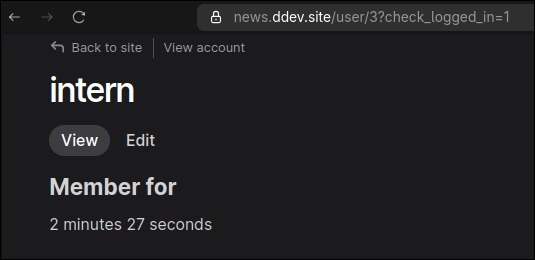

# Section 2
## Activity 2.2
### Advanced Drush Commands

#### . **Configuration with Drush**

1. `drush config:export`
    Export Drupal configuration to a directory.

2. `drush config:import`
    Import config from the config directory.

    

3. `drush config:get system.site`

    

4. `drush config:set system.site name "My Drush Site"`
   The `drush config:set` (alias `cset`) command allows you to **directly update configuration values** in Drupal without performing a full configuration import. You specify the config object (e.g., `system.site`), the key (e.g., `name` or `page.front`), and the new value. It supports simple string values as well as complex YAML input for updating nested arrays or multiple keys at once. For example, you can set the site name, change the front page path, assign user role permissions, or even pipe a full config from a YAML file using standard input. The `--input-format=yaml` option allows structured config editing, and using `?` as the key lets you update multiple top-level items at once. This command is ideal for quick edits or scripting config changes in development or automation workflows.

    

#### User management
    Drush comes with power to control the users and manage them like changing password, creating new users, blocking, unblocking, etc.
    I have practiced below user operations.

   drush user:create intern --mail="intern@example.com"
   drush user:password intern "newpassword"
   drush user:login intern
   drush user:block intern
   drush user:unblock intern
   drush user:information intern

#### Content Operations

1. `drush entity:create`
    Create a content entity after prompting for field values. When entering field values, one may submit an incomplete document and any entity violations will be helpfully reported at the top of the document. enter skip as a value in order to skip validation for that field. Timestamp values may be expressed via any string recognized by strtotime()

    

2. `drush entity:generate`

    Delete content entities.

    drush entity:delete node --bundle=article. Delete all article entities.
    drush entity:delete shortcut. Delete all shortcut entities.
    drush entity:delete node 22,24. Delete nodes 22 and 24.
    drush entity:delete user. Delete all users except uid=1.
    drush entity:delete node --exclude=9,14,81. Delete all nodes except node 9, 14 and 81.
    drush entity:delete node --chunks=5. Delete all node entities in steps of 5.

    

3. `drush entity:save`

    Load and save entities.

    drush entity:save node --bundle=article. Re-save all article entities.
    drush entity:save shortcut. Re-save all shortcut entities.
    drush entity:save node 22,24. Re-save nodes 22 and 24.
    drush entity:save node --exclude=9,14,81. Re-save all nodes except node 9, 14 and 81.
    drush entity:save user. Re-save all users.
    drush entity:save node --chunks=5. Re-save all node entities in steps of 5.

`   
