# Section 3 Contributed Modules
## Activity 3.1
### Essential Module Research

| name | purpose | last update | Security coverage | Dependencies | Community usage | Documentation quality | Would recommend |
|-|-|-|-|-|-|-|-|
| Admin toolbar | Imporved default toolbar for easier navigation |  4 June 2025 (3.6.1) | Covered by drupal team | Toolbar | High 312,172 websites with 317 stars | High | Yes |
| Pathauto | Autometically generates path/URL for content |  1 Aug 2024 (1.13) | Stable release covered by drupal team | Token, *CTools** | High 500,629 websites and 306 stars | High | Yes
| Token | Provides placeholder variables (tokens) and an interface. [user:name] | 28 July 2024 (1.15) | Covered by drupal team | N/A | High 557,508 websites with 228 stars | Good | Yes |
| Webform | Build any type of form to collect any type of data | 21 march 2025 (6.3.0-beta2) | Stable release covered  by drupal team | Field, Filter, User, System | High 351,000 websites with 428 stars | High | Yes|
| Metatag | automatically provide structured metadata | 29 May 2025 (2.1.1) | Covered by drupal core | Token, PHP8 | High 361,104 websites with 270 stars | High | Yes
| gin | Claro based theme completely redesigns UI layout, enhanced with features like Darkmode. | 28 Feb 2025 (4.0.6) | Drupal core | N/A | Good 74,260 website with 351 stars | High | Yes|
| Views Entity Reference Filter | A user-friendly Views filter for configurable entity reference fields. | 31 Jan 2025 (2.1.0) | Drual | N/A | Low 9,627 websites with 62 stars | Low | If user want to refer the views entity |
| Better exposed filters | replaces the Views' default single- or multi-select boxes with radio buttons or checkboxes, respectively. | 31 Jan 2025 (7.0.5) | Drupal | N/A | Medium 179,000 Websites with 197 stars | High | Yes |
| facets | Allows site builders to easily create and manage filters which limit themself based on the results. | 3 Jan 2025 (3.0.0) | Drupal | N/A requirements are for dev | Medium 49,800 websites with 150 stars | High | Depends |
| Computed field | lets you add a custom "computed fields" to your content types. These computed fields are populated with values that you define in PHP code. | 22 Oct 2024 4.0.0-beta2 | Warn for drupal <9 | N/A | Low 18,645 websites with 88 stars | Medium | Depends |
| Config split | Configuration filter for importing and exporting extra config | 12 feb 2025 (2.0.2) | Drupal | N/A req for dev | medium 74,500 websites with 222 stars | High | Yes|
| devel | contains helper functions and pages for Drupal developers and inquisitive admins | 10 Aug 2024 (5.3.1) | Drupal | doctrine/common, symfony/var-dumper, PHP8 | High 151,500 websites with 231 stars | High | Yes |
| paragraphs | Makes cleaner content creation so that you can give more editing power to your end-users. | 2 mar 2025 (1.19) | Drupal | drupal/entity_reference_revisions | High 245,000 sites with 429 stars | High | Yes |
| Search API | creating searches on any entity known to Drupal, using any kind of search engine. | 23 Feb 2025 (1.38) |  Drupal| N/A | High 154,100 websites with 225 stars | High | Yes |
| Simple OAuth | OAuth Authorization framework | 7 Mar 2025 (6.0.0) | Drupal | drupal/consumers, league/oauth2-server, PHP8, steverhoades/oauth2-openid-connect-server | Low 15,900 websites with 146 stars | Good | Depends (headless) |
| JSON:API Views | creates display, allowing for easy consumption of views outside of Drupal. | 20 feb 2023 (1.1) | Drupal | drupal/jsonapi_resources | Low 1,817 websites and 42 stars | Good | Depends |
| Migrate tools | Tools for running and managing Drupal migrations.| 6 Now 2024 (6.0.5) | Drupal | drupal/migrate_plus, drupal/migrate_source_csv,drush/drush | Medium 63,987 websites and 90 stars | High | Yes |
| tmgmt | The Translation Management tool | 15 Nov 2024 (1.17) | Drupal| N/A | Low 10,400 sites with 113 stars | High | Yes|

### Screenshots

Admin toolbar
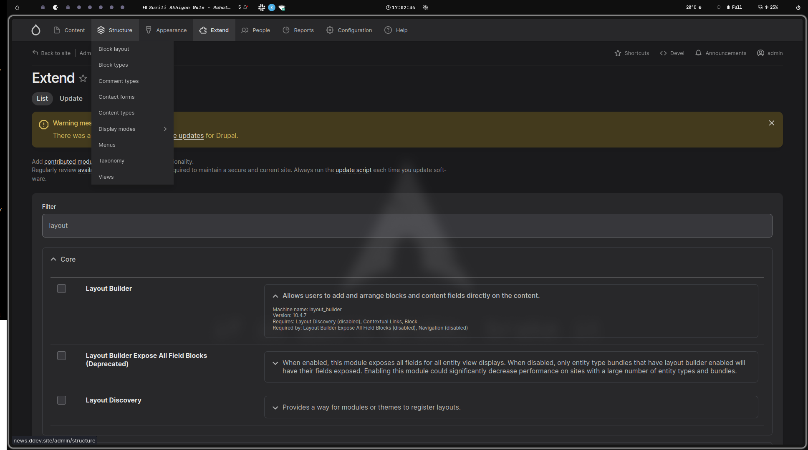
Path auto
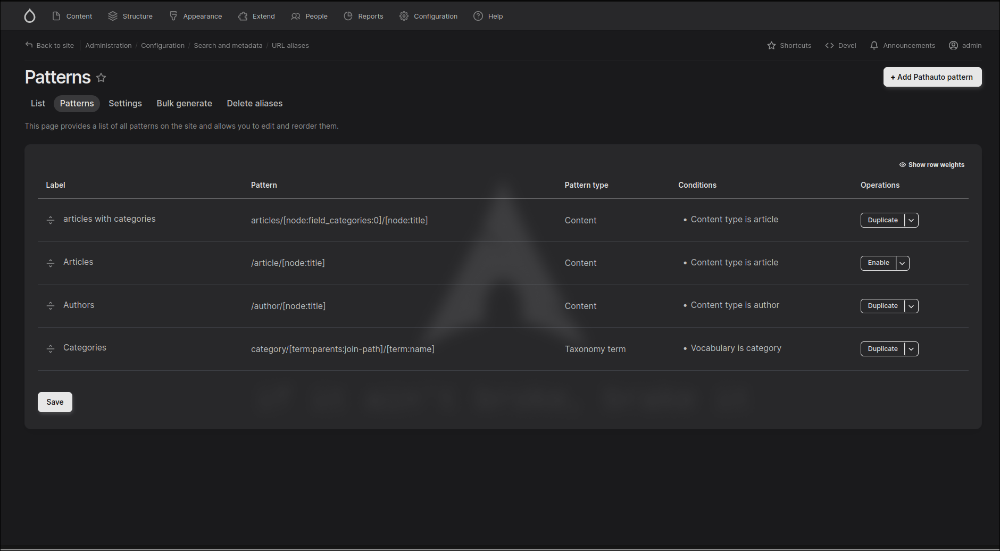
Webform
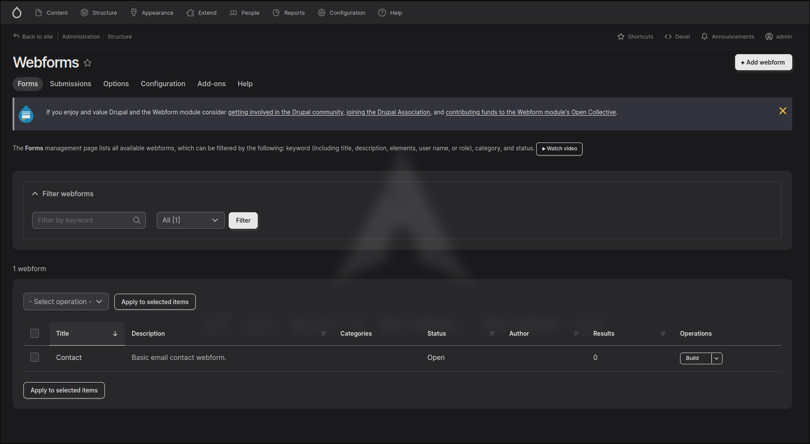
Metatag
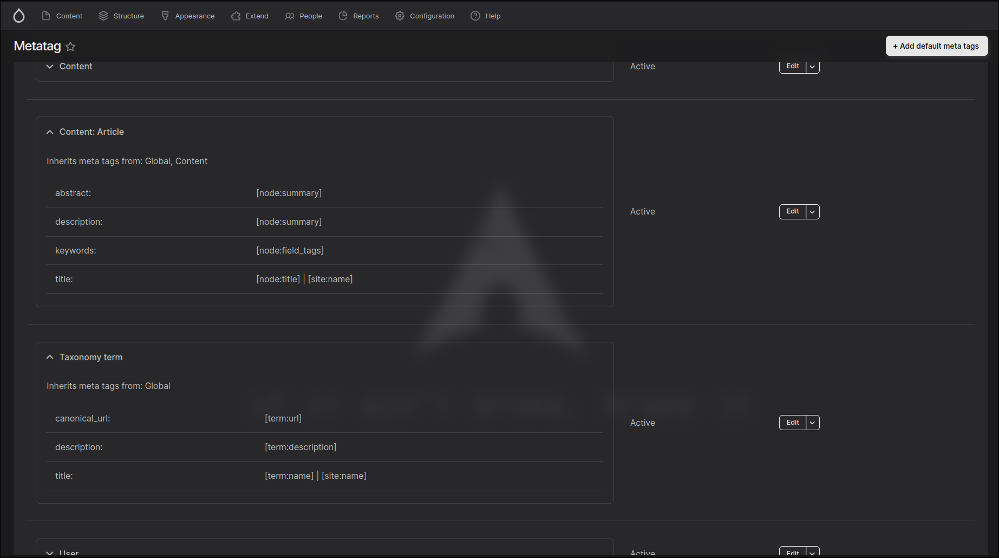
Views Entity Reference Field
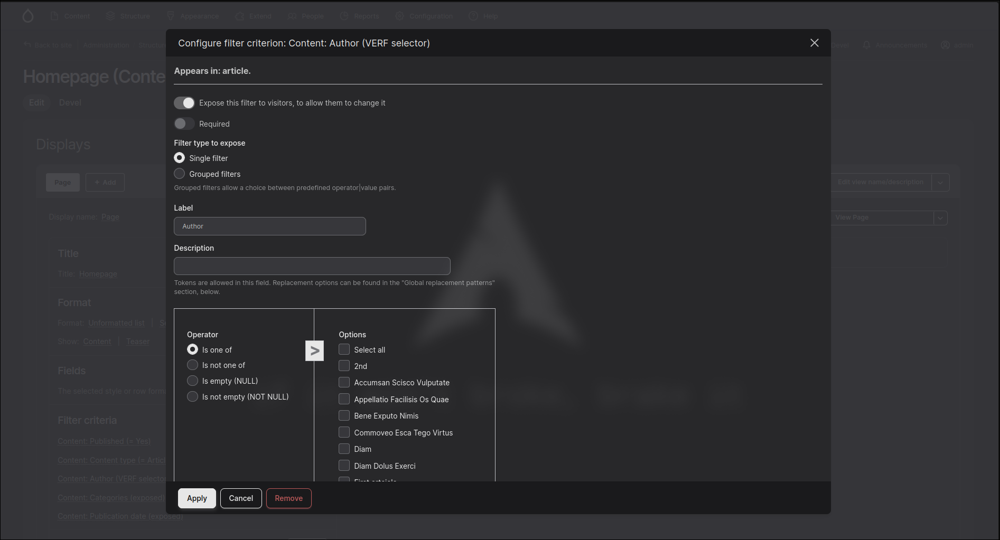
Better exposed filters
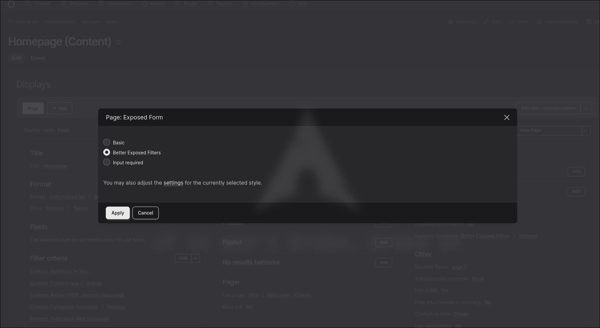
facets
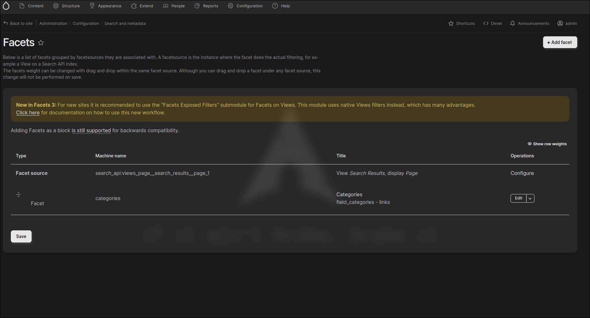
Computed fields
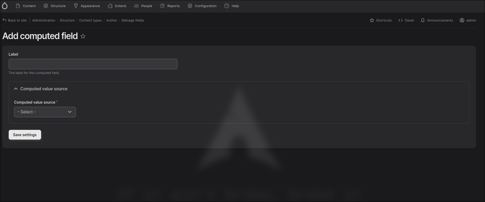
config split
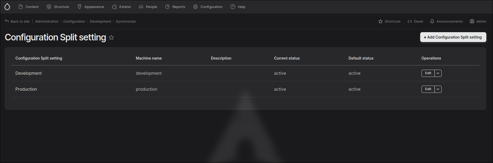
devel
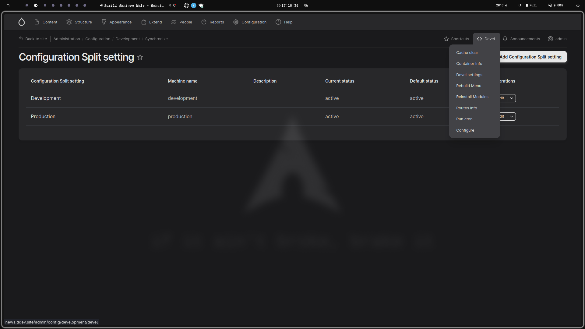
paragraphs
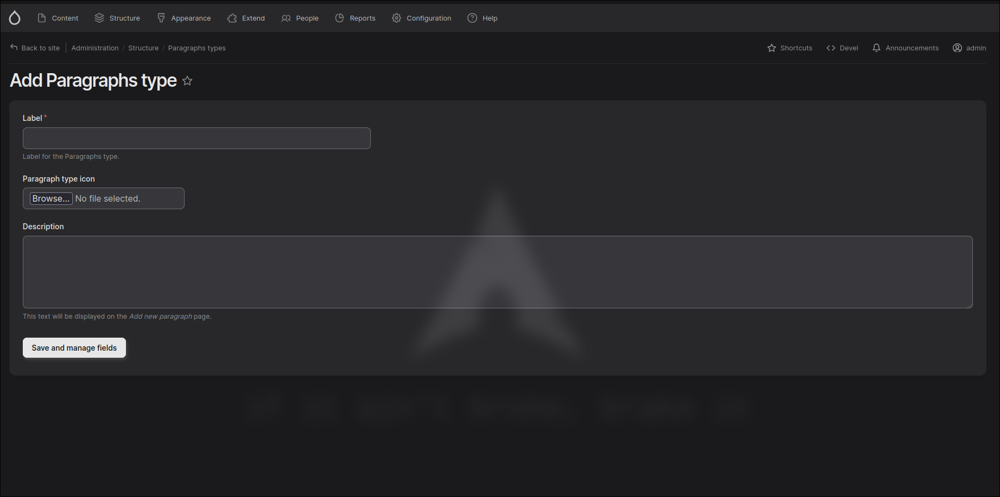
search api
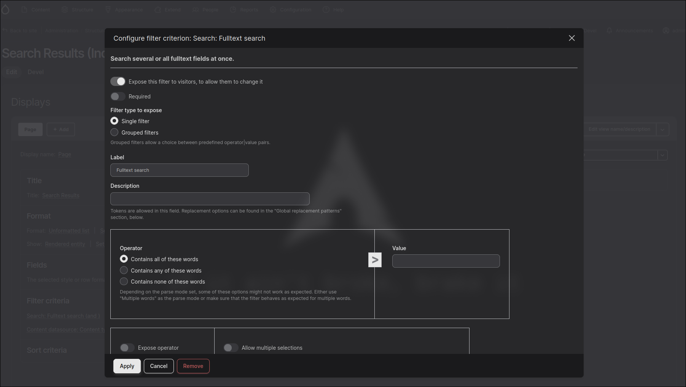
